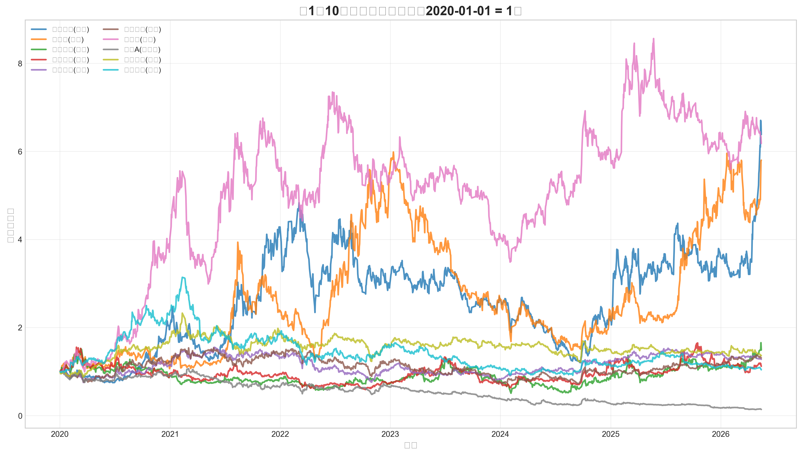
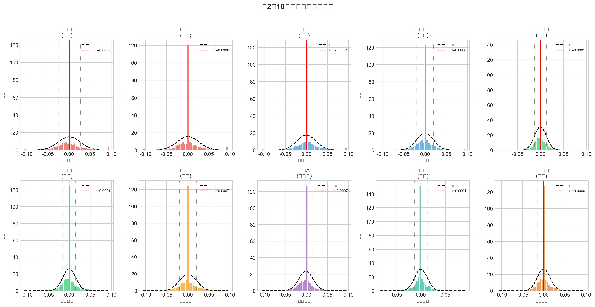
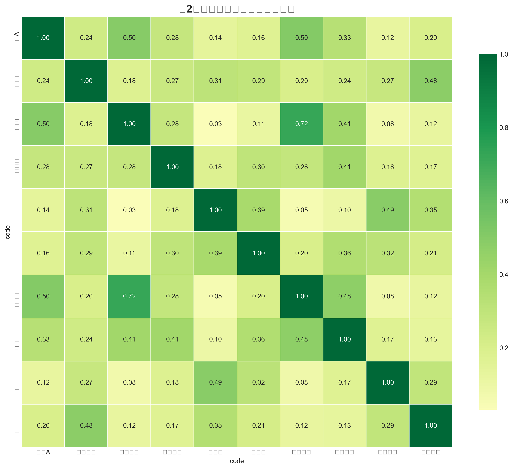
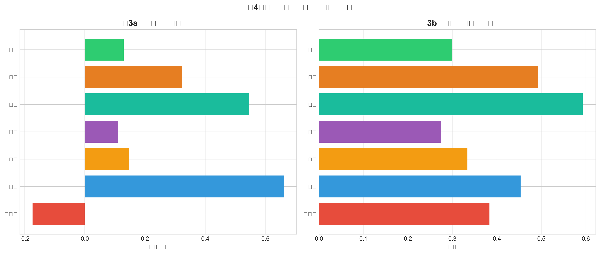
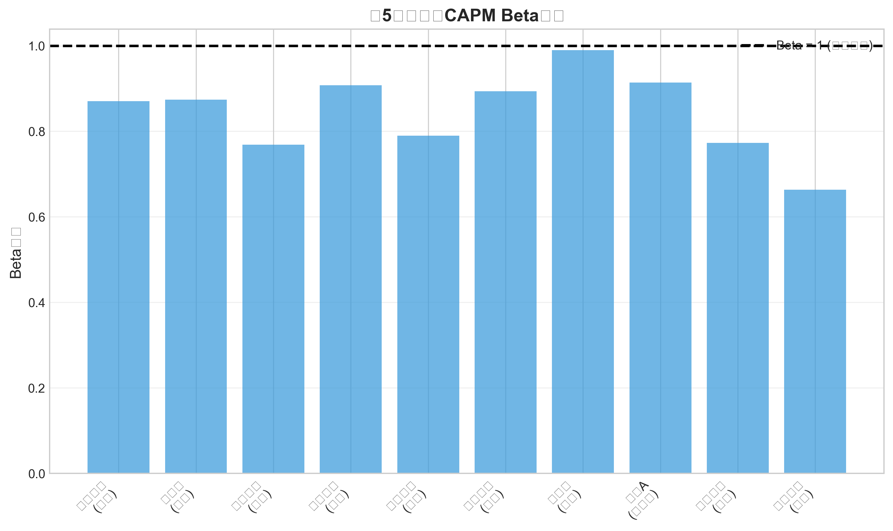
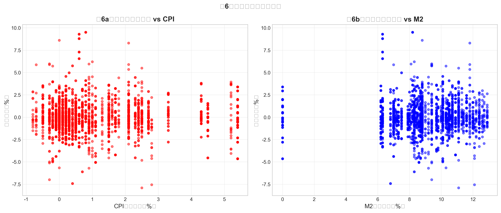

# 金融数据获取、管理与初步分析

**学号**：25210124
**姓名**：邓佳鸣
**GitHub**：https://github.com/JM-25MDE/dshw-p01

---

## 一、项目概述

本作业完成金融数据获取、管理与初步分析的全流程实践，选取10只A股股票（覆盖7个行业），时间跨度2020-01-01至今。

## 二、数据来源

| 数据类型 | 来源 | 工具 |
|----------|------|------|
| 股票日度行情 | AKShare | `ak.stock_zh_a_hist()` |
| 沪深300指数 | AKShare | CAPM市场基准 |
| 创业板指 | AKShare | 自选指数 |
| CPI同比增速 | AKShare | 宏观通胀指标 |
| M2同比增速 | AKShare | 货币政策指标 |
| 财务指标 | AKShare | ROE、净利润率 |

## 三、描述性统计

| 股票 | 行业 | 年化收益率 | 年化波动率 | 最大回撤 |
|------|------|-----------|-----------|---------|
| 禾望电气 | 能源 | 16.67% | 41.96% | -81.18% |
| 科士达 | 能源 | 15.81% | 41.08% | -78.68% |
| 比亚迪 | 汽车 | 16.38% | 31.96% | -56.05% |
| 招商银行 | 银行 | 2.22% | 20.42% | -54.64% |
| 贵州茅台 | 白酒 | 2.78% | 20.46% | -54.22% |
| 万科A | 房地产 | -17.54% | 26.89% | -90.66% |

---

## 四、可视化分析

### 图1：归一化收盘价走势

能源股和比亚迪涨幅最大，万科A受房地产行业影响表现疲弱。

### 图2：日收益率分布

所有股票收益率呈现尖峰厚尾特征，偏离正态分布。

### 图3：收益率相关系数热力图

同行业股票相关性较高（如银行股之间接近0.9），跨行业相关性较低。

### 图4：行业对比分析

### 图5：CAPM Beta系数

Beta系数范围0.66-0.99，银行股Beta较高但Alpha不显著。

### 图6：宏观敏感性分析

不同行业对宏观指标（CPI、M2）的敏感性存在差异。

---

## 五、CAPM回归结果

| 股票 | 行业 | α | β | R² |
|------|------|---|---|-----|
| 禾望电气 | 能源 | 0.24%* | 0.87 | 0.03 |
| 科士达 | 能源 | 0.18%* | 0.87 | 0.04 |
| 比亚迪 | 汽车 | 0.25%* | 0.99 | 0.07 |
| 招商银行 | 银行 | 0.04% | 0.79 | 0.14 |
| 贵州茅台 | 白酒 | 0.04% | 0.77 | 0.12 |

*表示p<0.05显著

### 分析讨论

1. **Beta系数**：所有股票Beta均小于或接近1，说明波动性低于或接近市场。能源股Beta接近1，符合周期性行业特征；银行股Beta约0.8，体现防御属性。

2. **Alpha显著性**：能源股（禾望电气、科士达）和比亚迪的Alpha显著为正，可能存在超额收益机会。

3. **R²差异**：银行股R²最高（0.14），说明其收益变化更可由市场解释；能源股R²较低，个股特质风险占主导。

---

## 六、存储格式对比

| 格式 | 文件大小 | 特点 |
|------|---------|------|
| CSV | 3.8MB | 通用性强，可读性好 |
| Parquet | 0.8MB | 列式存储，体积小 |
| SQLite | 4.0MB | 支持SQL查询 |

---

## 七、作业完成情况

- [x] 数据获取（股票、指数、宏观、财务）
- [x] 目录结构与存储规范（CSV + Parquet + SQLite）
- [x] 数据清洗（6步流程）
- [x] 可视化（图1-6）
- [x] CAPM回归分析
- [x] 宏观指标影响分析（选做）
- [x] Quarto电子书

---

## 相关文件

- [数据下载 Notebook](01_download.ipynb)
- [数据清洗 Notebook](02_clean.ipynb)
- [数据分析 Notebook](03_analysis.ipynb)
